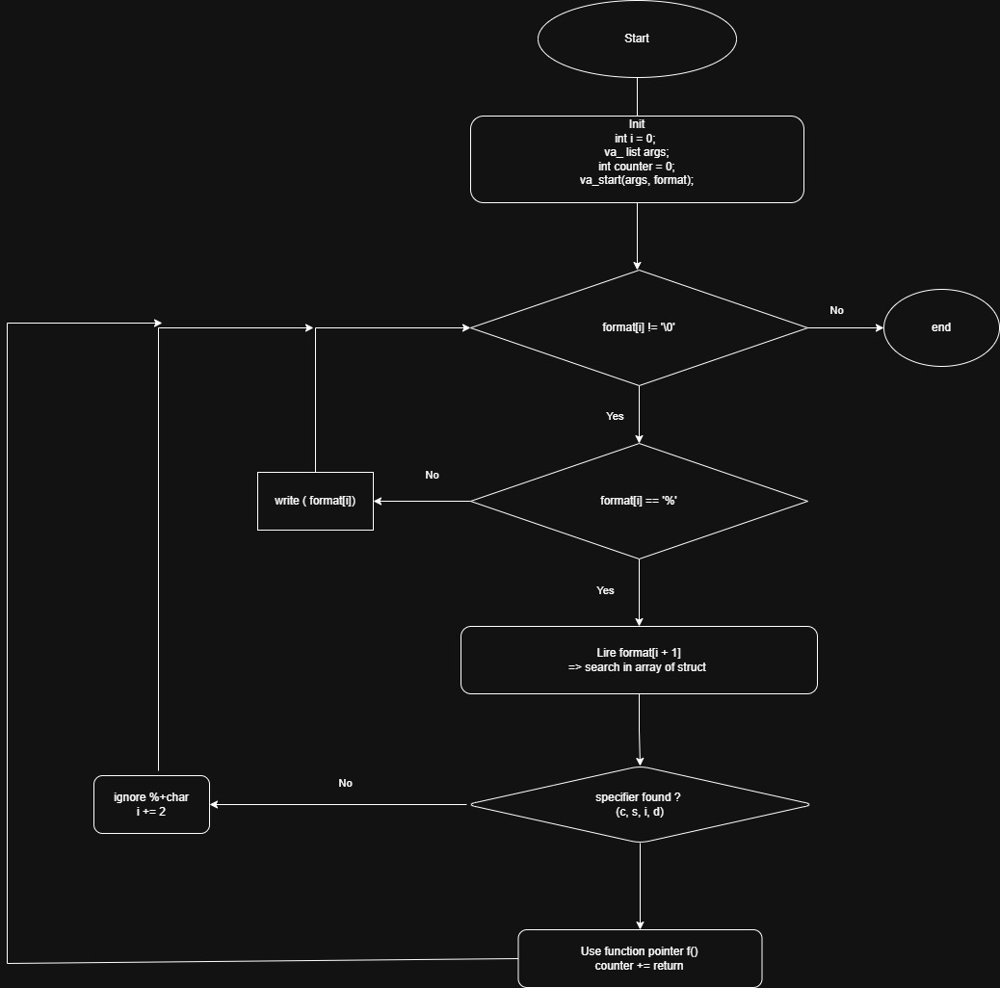

# Integration Project: printf

## Description

The `printf` project consists in recreating a simplified version of the standard C function `printf`.

The goal is to understand how formatted output works internally:
- Parsing a format string
- Handling variadic arguments (`va_list`)
- Dispatching functions based on specifiers
- Managing output character by character

This project is a key milestone in low-level programming and reinforces core concepts such as:
- Pointers
- Function pointers
- Structures
- Memory handling
- Recursion

---

## Prototype

```c
int _printf(const char *format, ...);
```

## Functions Description

### print_char

```c
int print_char(va_list args);
```
Prints a single character: 
Retrieves an int from va_list
Casts it to a character
Prints it using _putchar
Returns 1

### print_string
```c
int print_string(va_list args);
```
Prints a string:
Retrieves a char * from va_list
Prints each character until '\0'
If NULL, prints (null)
Returns the number of characters printed

### print_int
```c
int print_int(va_list args);
```
Prints an integer:
Retrieves an int from va_list
Handles negative numbers
Prints digits recursively
Returns the number of characters printed

### print_percent
```c
int print_percent(va_list args);
```
Prints the % character:
Ignores va_list
Prints % using _putchar
Returns 1

## Flowchart

The following diagram illustrates the process of parsing the format string, detecting specifiers, and calling the associated functions.

<p align="center">
  
</p>

## Project GitHub Flow

For this project we will use externals ressources in order to have a nice collaboration flow.

Using keywords to prefix branches and commits messages like:

- feat
- docs
- fix

<u>examples</u>:\
branch -> "feat/build-main-header"\
commit -> "docs: adding gitflow chapter to readme"

### How to push my work ?

In order to make a new feature, fix or documentation I need to make a new branch as explain above. 
```bash
git checkout -b <branch-name>
```

When work is done I fetch the parent branch (dev) to see there is some change, if there are changes I need to pull and merge.
```bash
git checkout dev
git fetch
git pull
git checkout <working-branch>
git merge dev
```
This process avoids breaking dev or main branch. So I need to resolve conflict on my working branch before making a PR on GitHub and merge on dev.

If I have a new PR from my coworker I need to check his code and  comment if I have questions or validate the PR to merge.

## Ressources:

### Github Flow:
- https://githubflow.github.io/
- https://nvie.com/posts/a-successful-git-branching-model/

### Naming convention (branches and commits messages)
- https://buzut.net/cours/versioning-avec-git/bien-nommer-ses-commits
- https://codeheroes.fr/blog/git-comment-nommer-ses-branches-et-ses-commits/

### Markdown styling documentation
- https://google.github.io/styleguide/docguide/style.html
